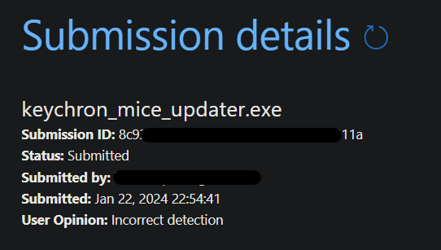
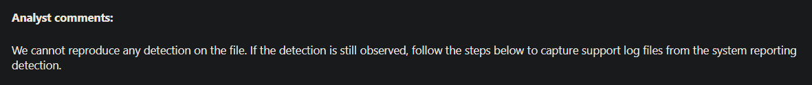

## Anti-virus detection

Sometimes the windows defender deteced the software as a virus. This is a false positive. The software is open source, so you can check the code yourself. If you don't trust me, you can always download the source code and build it yourself.

I have already opened an ticket with Microsoft to get the software whitelisted. Check the picture below for the submission.

**Update:** This is the response I got from Microsoft:

I also manually rescanned the file, but couldn't get it to throw a false positive. I will watch this issue further and update this section if anything changes. Please let me know if you have any problems with the software and the AV.

## VirusTotal

I have also scanned the file with VirusTotal. You can see the results [here](www.virustotal.com/gui/file/17894a2bb63c50e34e0def96e142d74be5cf56457d62d23e3730e02d47ba2c31)
