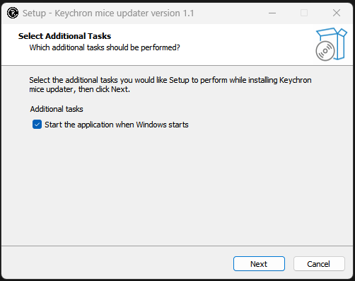
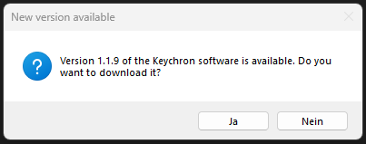
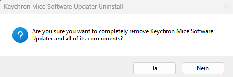

# Keychron mice Software Updater

This Python script automatically checks for a new version of the Keychron mice software and downloads it if a new version is found.

## Table of Contents

- [Installation](#installation)
- [Usage](#usage)
- [Uninstallation](#uninstallation)
- [Problem reports](#problem-reports)
- [Anti-virus detection](#anti-virus-detection)
- [FAQ](#faq)
- [Thanks to](#thanks-to)
- [Contributing](#contributing)
- [Disclaimer](#disclaimer)

## Installation

1. Navigate to the [Releases](https://github.com/Pyenb/Keychron_mice_software_updater/releases) section of this repository.
2. Download the latest release of the Keychron Software Updater.
3. Extract the downloaded `.zip` file.
4. Run the downloaded `.exe` file to start the installation process. Follow the prompts to complete the installation.

## Usage

1. **Startup**: After installation, the Keychron Software Updater will automatically check for updates to the Keychron software every time you start your computer. (Make sure to check the "Run Keychron Software Updater on startup" checkbox during installation.)

2. **Update Notification**: If a new version is found, the Keychron Software Updater will prompt you to download the new version.

3. **Download and Installation**: If you choose "Ok", the Keychron Software Updater will automatically download the new version and start the installation process.

4. **Cleanup**: After the installation process is complete, the Keychron Software Updater will automatically delete the downloaded installer.

## Uninstallation

To uninstall the Keychron Software Updater:

1. Open the Control Panel.
2. Click on "Uninstall a program" under Programs.
3. Find "Keychron Software Updater" in the list of installed programs and click on it.
4. Click on the "Uninstall" button that appears.

## Problem reports

The software will break if Keychron changes the download link for the software. If this happens, please open an issue with your received error message and I will try to assist you as soon as possible.

## Anti-virus detection

For information regarding anti-virus detection, please see the [av.md](av.md) file.

## FAQ

**Q: Why is the executable so big?**

A: The executable is so big because it contains the python interpreter and all the dependencies. This is because I used [PyInstaller](https://www.pyinstaller.org/) to create the executable. I am currently looking into other ways to create the executable.

**Q: Why the installer?**

A: I used [Inno Setup](https://jrsoftware.org/isinfo.php) to create the installer. This is because I wanted to make the installation process as easy as possible. Also it makes uninstalling and starting the software on startup easier.

**Q: Why does the software need admin privileges?**

A: The official Keychron software needs the admin privileges to install their software.

## Thanks to

- [wkentaro](https://github.com/wkentaro) for making [gdown](https://github.com/wkentaro/gdown)
- [Keychron](https://www.keychron.com/) for making great products, even tough all my batteries are failing.

## Contributing

Pull requests are welcome. For major changes, please open an issue first to discuss what you would like to change.

## Disclaimer

This repository is for research purposes only, the use of this code is your responsibility.

I take NO responsibility and/or liability for how you choose to use any of the source code available here. By using any of the files available in this repository, you understand that you are AGREEING TO USE AT YOUR OWN RISK. Once again, ALL files available here are for EDUCATION and/or RESEARCH purposes ONLY.
