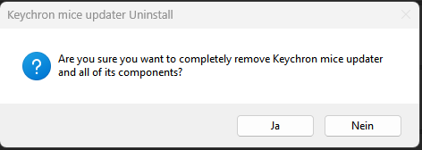

# Keychron Wireless Mouse Software Updater

This is a Python script, bundled into an executable, that checks for a new version of the [Keychron Wireless Mouse Software](https://www.keychron.com/pages/learn-more-how-to-use-keychron-mouse-software) and asks the user if they want to download and install the new version. The software will automatically start on startup and check for updates.

## Table of Contents

- [Installation](#installation)
  - [Supported mice](#supported-mice)
- [Usage](#usage)
  - [Updating the Keychron software](#updating-the-keychron-wireless-mouse-software)
  - [Updating the updater](#updating-the-updater)
- [Problem reports](#problem-reports)
- [Anti-virus detection](#anti-virus-detection)
- [FAQ](#faq)
- [Thanks to](#thanks-to)
- [Uninstallation](#uninstallation)
- [Contributing](#contributing)
- [Disclaimer](#disclaimer)

## Installation

1. Navigate to the [Releases](https://github.com/Pyenb/Keychron_mice_software_updater/releases) section of this repository.
2. Download the latest release of the Keychron Software Updater.
3. Extract the downloaded `.zip` file.
4. Run the downloaded `.exe` file to start the installation process. Follow the prompts to complete the installation.

### Supported mice

This updater is for the [Keychron Wireless Mouse Software](https://www.keychron.com/pages/learn-more-how-to-use-keychron-mouse-software). Anything supported by the official software should work. You should know what software you are using.

## Usage

### Updating the Keychron wireless mouse software

1. **Startup**: After installation, the Keychron Software Updater will automatically check for updates to the Keychron software every time you start your computer. (Make sure to check the "Run Keychron Software Updater on startup" checkbox during installation.)

2. **Update Notification**: If a new version is found, the Keychron Software Updater will prompt you to download the new version.

3. **Download and Installation**: If you choose "Ok", the Keychron Software Updater will automatically download the new version and start the installation process.

4. **Cleanup**: After the installation process is complete, the Keychron Software Updater will automatically delete the downloaded installer.

### Updating the updater

When there is a new version of the Updater available, you will be prompted to check it out. If you choose "Yes", you will be taken to the [Releases](https://github.com/Pyenb/Keychron_mice_software_updater/releases) section.

###### Note: This is only available since version 1.3 and later

## Problem reports

The software will break if Keychron changes the download link for the software. If this happens, please open an issue with your received error message and I will try to assist you as soon as possible. There is an issue template available to help you with the information I need to help you.

## Anti-virus detection

Any anti-virus detection is a false positive, please see the [av.md](av.md) for more information.

## FAQ

**Q: Why the installer?**

A: I used [Inno Setup](https://jrsoftware.org/isinfo.php) to create the installer. This is because I wanted to make the installation process as easy as possible. Also it makes uninstalling and starting the software on startup easier.

**Q: Why?**

A: Because Keychron's software doesn't have an auto-update feature.

## Thanks to

- [wkentaro](https://github.com/wkentaro) for making [gdown](https://github.com/wkentaro/gdown)
- [Keychron](https://www.keychron.com/) for making great products, even tough all my batteries are failing.

## Uninstallation

To uninstall the Keychron Software Updater:

1. Open the Control Panel.
2. Click on "Uninstall a program" under Programs.
3. Find "Keychron Software Updater" in the list of installed programs and click on it.
4. Click on the "Uninstall" button that appears.

## Contributing

Pull requests are welcome. For major changes, please open an issue first to discuss what you would like to change.

## Disclaimer

I am in no way affiliated with Keychron. This repository is for research purposes only, the use of this code is your responsibility.

I take NO responsibility and/or liability for how you choose to use any of the source code available here. By using any of the files available in this repository, you understand that you are AGREEING TO USE AT YOUR OWN RISK. Once again, ALL files available here are for EDUCATION and/or RESEARCH purposes ONLY.
